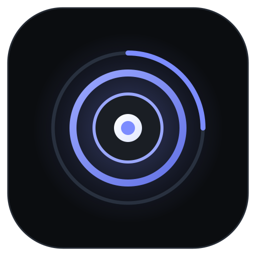
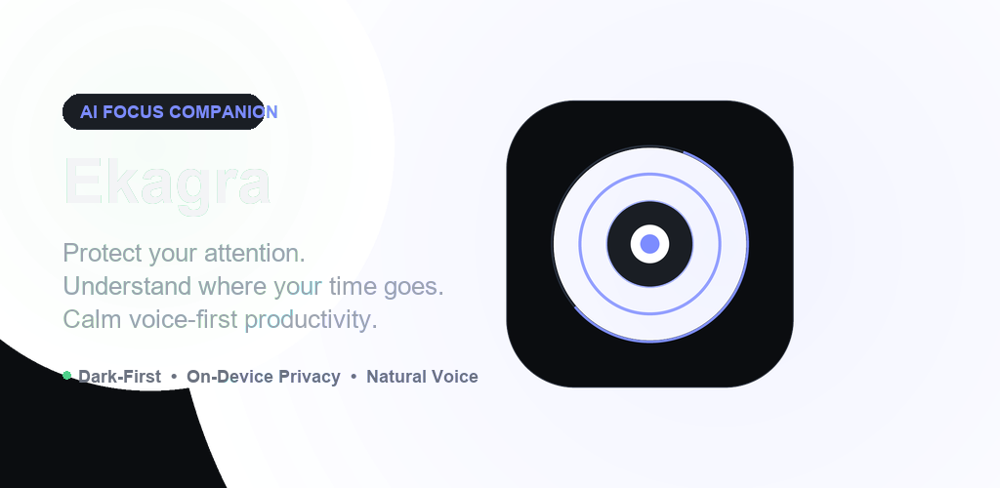
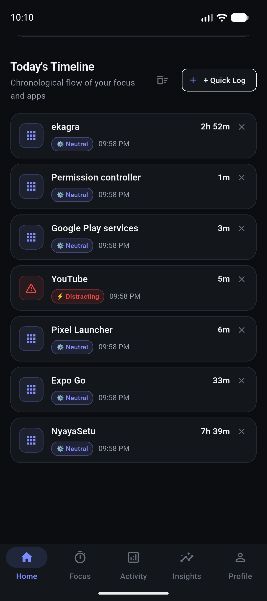
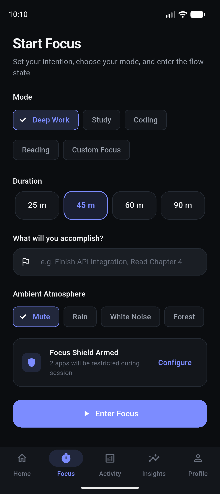
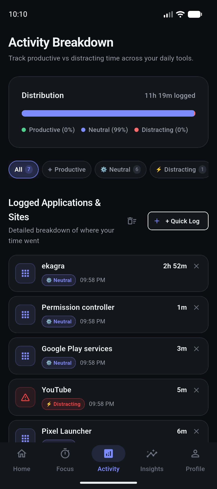
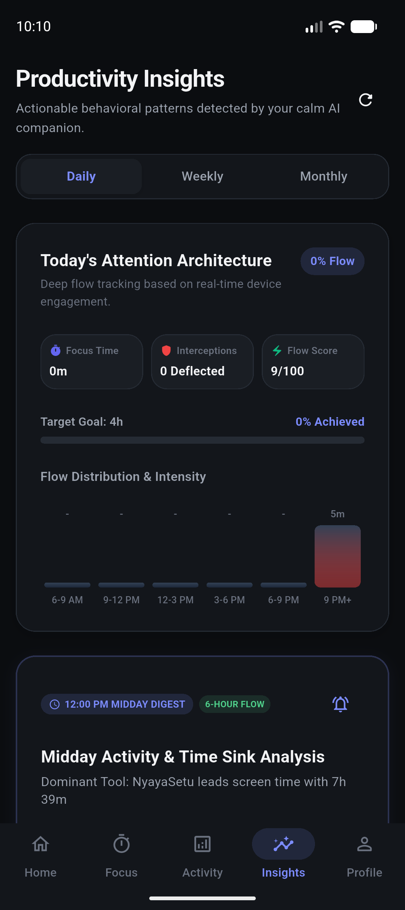
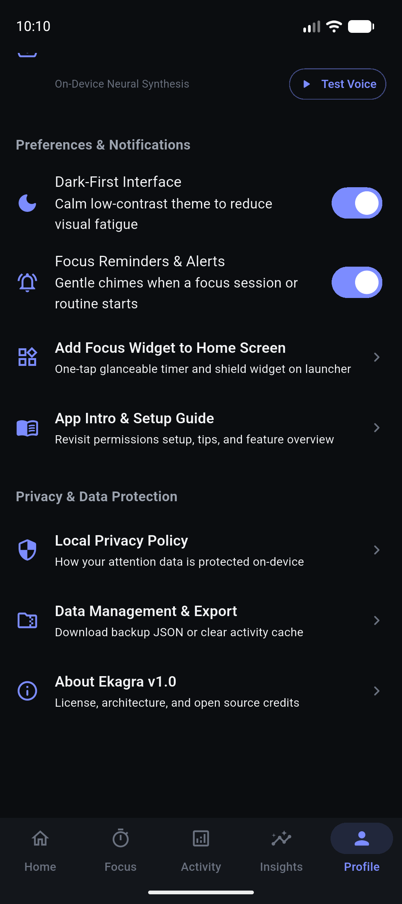
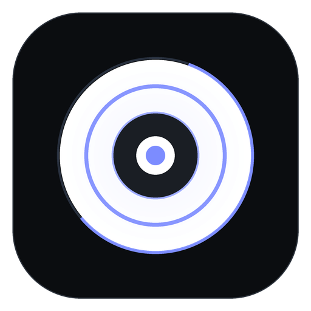
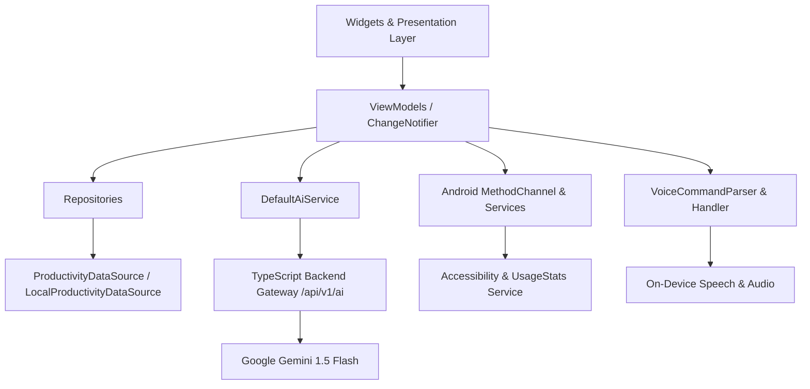

<div align="center">

  

  # Ekagra (एकाग्र)
  ### Intelligent AI Focus &amp; Attention Companion

  <p align="center">
    <b>A calm, modern, voice-first digital wellbeing and productivity companion designed to protect your attention, categorize your digital habits, and guide you into deep flow.</b>
  </p>

  <p align="center">
    <a href="https://github.com/RamanSharma100/ekagra"></a>
    <a href="LICENSE"></a>
    <a href="https://flutter.dev"></a>
    <a href="https://dart.dev"></a>
    <a href="https://material.io/design"></a>
    <a href="SECURITY.md"></a>
    <a href="CONTRIBUTING.md"></a>
  </p>

  

</div>

---

## 📖 Etymology & Philosophy

> **Ekagra** (*Sanskrit*: एकाग्र) translates to *"one-pointedness"* — undisturbed, undivided focus and absolute mental stillness on a single purpose.

In a hyper-connected world dominated by algorithms engineered to hijack user attention, modern productivity tools often add more noise with guilt-inducing alerts, red badges, and shrill popups. 

**Ekagra is built on an entirely different foundation:**
* **Calm AI Presence**: Ekagra guides rather than scolds. It observes habits gently without judgment.
* **Proactive Attention Defense**: Native Android background shielding instantly deflects distracting applications the moment an intentional focus sprint begins.
* **On-Device Data Sovereignty**: All app usage logs, habit graphs, and cognitive scores remain securely on your local device.
* **Dark-First Premium Visuals**: Low-contrast obsidian canvases (`#0B0D10`), balanced dark card surfaces (`#15181E`), and luminous indigo accents (`#6366F1`) tailored to reduce digital eye strain.

---

## 📸 Experience & Interface

| Home Dashboard | Zen Focus Session | Activity Analytics |
| :------------: | :---------------: | :----------------: |
|  |  |  |

| Behavioral AI Insights | Profile & Cognitive Rank | App Launcher Widget |
| :--------------------: | :----------------------: | :-----------------: |
|  |  |  |

---

## ⚡ Core Features

### 1. Home Dashboard & Circular Focus Score
* **Dynamic Focus Score**: Real-time circular SVG canvas painter calculating composite daily scores (0–100) based on active vs. distracted minutes against your calibrated goal.
* **State-Aware Sprint Card**: One-tap trigger when idle that seamlessly transitions into a live countdown with pause, resume, and completion actions.
* **Chronological Attention Stream**: Continuous timeline logging foreground application transitions and focus events.

### 2. Zen Focus Mode & Active Shielding
* **Focus Modes**: Deep Work, Study, Coding, Reading, and Custom.
* **Preset Durations**: 25m (Pomodoro), 45m, 60m, 90m, or arbitrary duration intervals.
* **Intention Anchors**: Explicitly note your singular goal before the timer starts.
* **Ambient Soundscapes**: Rain, Forest, White Noise, or silent focus.
* **Post-Session Reflection**: 1–5 star focus ratings, flow satisfaction notes, and milestone progression.

### 3. Native Distraction Blocker & Shield Service
* **Android Accessibility & AppOps Integration**: Real-time foreground app package detection (`UsageStatsManager`, `AccessibilityService`).
* **Instant Deflection**: Launches an overlay or reroutes to Ekagra with an encouraging mindful reminder when a blocked app is tapped.
* **Shield App Selector**: Full categorized catalog of installed apps with instant on/off shield switches.

### 4. Background Tracking & 6-Hour Analysis Engine
* **Always-On Background Service**: Android Foreground Service with ongoing notification keeping usage stats accurate without draining battery.
* **Periodic 6-Hour Attention Analysis**: Scheduled `WorkManager` background task evaluating usage every 6 hours and dispatching proactive notifications highlighting top time-consuming apps.
* **SQLite Persistence**: Local historical database storing granular app usage duration, session counts, and timestamp logs.

### 5. Behavioral AI Insights Engine
* Dynamic machine-generated cognitive patterns adapted to your actual usage:
  * **Peak Cognitive Flow Window**: Discovers your most productive time windows (e.g., 9 AM – 12 PM).
  * **Distraction Deflection Rate**: Quantifies shielded triggers and resistance trends.
  * **Momentum Days**: Discovers your peak performance days of the week.
* Interactive **Daily**, **Weekly**, and **Monthly** timeframe perspectives with metric delta counters.

### 6. Cognitive Leveling & Milestones
* **Progression Tiers (L1 to L10)**: Progress from *Cognitive Initiate* to *Deep Work Adept* and *Cognitive Master* as you complete sessions.
* **Milestone Badges**: Unlockable achievements (*First Flow*, *Iron Shield*, *Deep Horizon*, *Consistency Beacon*, *Target Smasher*) with interactive progress inspection.
* **Editable Profile**: Customize full name, email, and primary focus domain.

### 7. Natural Voice Companion & Audio Synthesis
* **Multi-State Voice UI**: Visual waveform animations reflecting `IDLE`, `LISTENING`, `PROCESSING`, and `SPEAKING` states.
* **On-Device Neural Voice Testing**: Test and calibrate voice synthesis speed directly in Profile settings.
* **Natural Intent Grammar**: Start sessions, pause timers, query app usage, or ask for daily summaries via spoken voice.

### 8. First-Run Personalization & Permissions Wizard
* **User Name & Identity Onboarding**: The app asks users for their name on first launch, ensuring dynamic, personalized greetings across voice synthesis, companion chats, and daily digests with zero hardcoded placeholders.
* **Craft & Role Calibration**: Select your primary craft (*Software Engineer*, *Student & Academics*, *Writer & Creator*, *Founder & Builder*, *Deep Work Practitioner*) and custom focus goal targets.
* **Permissions Calibration**: Interactive verification checklist for **Usage Access**, **Accessibility Shield**, and **Notifications** with live system grant detection.

### 9. Secure TypeScript Backend Gateway (`ekagra-server`)
* **Zero APK Secrets**: AI requests (chat companion, dynamic insights, Pomodoro day-planning) route through an external, standalone TypeScript Node.js backend.
* **Key Isolation**: The Google Gemini API key resides solely on the server in `.env`. Even if the APK is decompiled or reverse-engineered, zero LLM credentials or private secrets are exposed.
* **Grounded Prompting**: Server-side contextual prompt engineering strictly grounded in real device telemetry.

---

## 🏗 Architecture & Codebase Structure

Ekagra follows **Feature-First Clean Architecture** with SOLID principles and Provider-based reactive ViewModels:



### Directory Map

```
lib/
├── app/
│   ├── app.dart                   # MultiProvider root & theme sync
│   ├── app_shell.dart             # 5 bottom navigation tabs & voice overlay
│   └── theme/                     # Centralized design tokens (Colors, Typography, Spacing)
├── core/
│   ├── services/                  # AiService (Backend Proxy), VoiceService, NotificationService
│   └── widgets/                   # ProgressRing, VoiceWaveform, VoiceSheet, MetricCard
├── data/
│   ├── datasources/               # ProductivityDataSource & LocalProductivityDataSource
│   ├── models/                    # Clean domain models (Activity, Goal, Session, Badge, Insight)
│   └── repositories/              # ProductivityRepository, UserRepository
├── features/
│   ├── activity/                  # Breakdown & distribution analytics
│   ├── ai_companion/              # Conversational chat UI & voice interaction
│   ├── focus/                     # Zen focus timer & reflection flow
│   ├── goals/                     # Target hours and commitments
│   ├── home/                      # Overview dashboard & activity timeline
│   ├── insights/                  # Behavioral AI pattern engine
│   ├── onboarding/                # First-launch personalization & permission calibration wizard
│   ├── profile/                   # Cognitive leveling, badges, voice settings & JSON export
│   ├── routines/                  # Morning and evening habit alignment rituals
│   ├── shield/                    # Installed apps catalog & shield toggles
│   └── voice/                     # VoiceCommandParser & VoiceCommandHandler
└── services/
    └── app_blocker_service.dart   # Native Android platform channel bridge
```

---

## 🚀 Getting Started

### Prerequisites

* [Flutter SDK](https://flutter.dev/docs/get-started/install) (`>=3.13.2`, Flutter 3.47+ recommended)
* [Dart SDK](https://dart.dev) (`>=3.13.2`)
* Android SDK 35 (Android 15 supported)
* Java 17+

### Installation & Run

```bash
# Clone repository
git clone https://github.com/RamanSharma100/ekagra.git
cd ekagra

# Install Flutter dependencies
flutter pub get

# Run static code analysis
flutter analyze

# Execute test suite
flutter test

# Launch on connected Android device or emulator
flutter run
```

---

## 🔒 Security & Privacy

Ekagra treats attention and screen data with extreme privacy standards:
* **Zero Cloud Data Mining**: No application logs or focus transcripts are uploaded to third-party advertising or analytics networks.
* **On-Device Storage**: All state is saved locally.
* **Complete Data Portability**: One-tap full JSON database export and instant cache clearing are available in the Profile tab.

Read our full [SECURITY.md](SECURITY.md) for disclosure guidelines.

---

## 🤝 Contributing

We welcome contributions from developers, designers, and focus enthusiasts!
* Please review [CONTRIBUTING.md](CONTRIBUTING.md) before submitting pull requests.
* Read our [Code of Conduct](CODE_OF_CONDUCT.md).
* Submit issues and feature requests via [GitHub Issues](https://github.com/RamanSharma100/ekagra/issues).

---

## 👤 Author & Maintainer

**Raman Sharma**
* GitHub: [@RamanSharma100](https://github.com/RamanSharma100)
* Project Repository: [https://github.com/RamanSharma100/ekagra](https://github.com/RamanSharma100/ekagra)
* Support the Project: [GitHub Sponsors](https://github.com/sponsors/RamanSharma100)

---

## 📄 License

Ekagra is released under the **[MIT License](LICENSE)**.

© 2026 Raman Sharma ([@RamanSharma100](https://github.com/RamanSharma100)) & Ekagra Contributors. All rights reserved.
